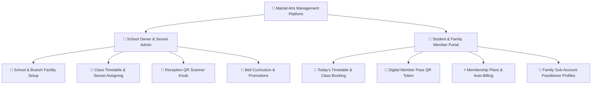

# 🥋 Martial Arts Academy Management System (Dojo OS)

## 📌 Executive Summary
The **Martial Arts Academy Management System** is an end-to-end, dual-role SaaS platform engineered specifically for **Martial Arts Dojos, Combat Gyms, and Academies** (Brazilian Jiu-Jitsu, Muay Thai, Karate, Taekwondo, Boxing, Krav Maga, Judo).

It unites **School Owners / Senseis / Academy Administrators** and **Students / Fighters / Parents** into a single seamless portal.

---

## 🏛️ System Architecture

### 1. Dual-Role Unified Portal

---

## 🌟 Feature Modules Breakdown

### 1. 🥋 Command Center Dashboard (`/` & `/dashboard`)
- **Dojo KPI Metrics**: Active Student count (142), Weekly Live Classes (28), Daily Check-ins, and Monthly Recurring Dojo Revenue ($8,420).
- **Belt Progression Radar**: Displays the active discipline (e.g. BJJ), current belt rank with stripes, certificate ID, and real-time attendance progress towards the next exam (e.g., 18/30 classes - 60%).
- **Today's Live Class Roster**: Direct list of classes occurring today with 1-click spot reservation.
- **Quick Action Station**: Direct shortcuts to schedule sessions, open QR pass, register new branch, or upgrade memberships.
- **Live Activity Stream**: Real-time log of scanned attendance and student promotions.

---

### 2. 🏢 School & Branch Management (`/school/create`, `/branches`, `/branch/create`)
- **School Profile**: Register master Dojo brand, business logo, banner cover, contact information, and martial arts disciplines taught.
- **Branch Locations (`/branches`)**: Full overview of multi-location training facilities with tatami mat count, phone numbers, and belt grading enablement.
- **Branch Creation (`/branch/create`)**: Multi-step wizard to setup tatami mats, assign local branch administrators, and configure location coordinates.

---

### 3. 📅 Classes, Timetable & Spot Booking (`/classes` & `/booking`)
- **Interactive Timetable**: Browse sessions filtered by discipline (BJJ, Muay Thai, Karate, Taekwondo, Boxing) and day of the week.
- **1-Click Class Booking**: Reserve spots in live training sessions with automatic capacity tracking (`enrolled_count / max_capacity`).
- **Sensei Management Modal**: School owners can dynamically schedule new classes, set room locations (Mat A, Mat B), and assign instructors.
- **My Bookings (`/booking`)**: View active reservations, attendance status (`Confirmed`), and cancel spots in 1 click.

---

### 4. 📱 Dynamic Digital QR Pass & Scanner Kiosk (`/qr-code`)
- **Student Digital Pass**: Generates dynamic check-in tokens with copyable pass codes and timestamped verification.
- **Reception Scanner Kiosk**: School receptionists can open the Kiosk modal, input/scan student pass tokens, and instantly verify dojo check-in attendance with real-time feedback.

---

### 5. ⭐ Membership Tiers & Billing (`/membership` & `/payment`)
- **3 Plan Tiers**:
  - **Starter Dojo Pass**: $49/month (2 sessions/week).
  - **Unlimited Warrior**: $89/month (Unlimited training + open mats).
  - **Black Belt VIP**: $149/month (Private master coaching + belt exam fees included).
- **Billing Toggle**: Switch between Monthly and Yearly billing (with 20% discount).
- **Payment & Wallet (`/payment`)**: Manage credit cards, billing addresses, and view payment transaction history.

---

### 6. ⚙️ Account Settings & Family Sub-Accounts (`/setting`)
- **My Profile (`/setting?tab=profile`)**: Update First Name, Last Name, Phone, Address, City, Country, and upload custom profile photos or choose from martial arts avatar presets.
- **Family Sub-Accounts (`/setting?tab=sub-account`)**: Parents can register and manage child practitioner profiles, track their individual belt ranks, and book junior classes.
- **Security (`/setting?tab=change-password`)**: Update passwords and login credentials.
- **Enrolled Dojo (`/setting?tab=enrolled-school`)**: View home martial arts academy details.

---

## 🚀 How to Run & Access

### 1. Frontend Web App
- URL: `http://localhost:3000`
- Tech Stack: React 18, TypeScript, Redux Toolkit, Ant Design, Styled Components, Bootstrap 5.

### 2. Backend REST API
- URL: `http://localhost:8000`
- Interactive Swagger UI: `http://localhost:8000/docs`
- ReDoc Explorer: `http://localhost:8000/redoc`
- Tech Stack: FastAPI, Python 3.9, SQLAlchemy Async, SQLite / PostgreSQL, Pydantic v2.
