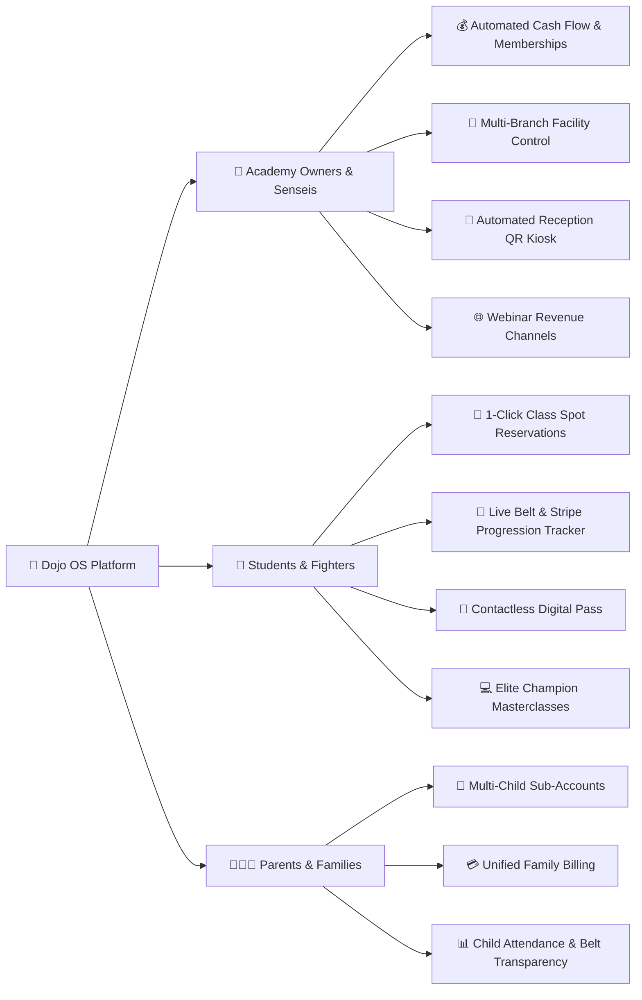

# 🥋 Martial Arts Academy Management System (Dojo OS)
## Strategic Objectives, Core Benefits & Business Value Guide

---

## 🎯 1. Core Objectives: Why This Platform Exists

Traditional martial arts schools, combat gyms, and dojos (BJJ, Muay Thai, Karate, Taekwondo, Boxing, Krav Maga, Judo) face major operational bottlenecks:
- **Manual Paper Attendance & Front-Desk Chaos**: Students lining up to sign in on clipboards or scan faulty plastic key fobs.
- **Lost Revenue & Payment Churn**: Missed membership renewals, manual cash collection, and lack of stored digital wallets.
- **Untracked Belt Progression**: Senseis manually guessing when a student is eligible for their next stripe or belt grading exam.
- **Physical Mat Capacity Constraints**: School revenue is capped by physical room dimensions and class time slots.
- **Disjointed Multi-Branch Operations**: Difficulties managing multi-location dojos and franchise locations under one standard.

### 💡 The Solution: Dojo OS
This platform acts as an **all-in-one operating system** engineered specifically to digitize dojo management, automate recurring cash flow, gamify student retention through belt progression, and unlock new digital revenue streams through online masterclasses and webinars.

---

## 💎 2. Key Stakeholder Benefits & Value Propositions



---

### 🏢 A. Benefits for Academy Owners, Senseis & Managers

| Benefit | Operational Impact | Business Result |
|---|---|---|
| **Automated Recurring Billing** | Eliminates manual cash collection; auto-renews monthly & yearly memberships via saved credit cards. | **+25% to +40% increase in predictable Monthly Recurring Revenue (MRR)**. |
| **Contactless QR Scanner Kiosk** | Receptionists scan member passes directly from the web app (`/qr-code`), automatically logging timestamps and attendance. | **Saves 10-15 hours/week of front-desk administrative overhead**. |
| **Multi-Branch & Franchise Scalability** | Centrally manage multiple physical dojo facilities, tatami mat allocation, and local branch managers from `/branches` & `/franchise/list`. | **Enables effortless multi-location expansion without software fragmentation**. |
| **Class Capacity Optimization** | Real-time tracking of spots (`enrolled_count / max_capacity`) prevents overcrowding on the mats and maintains coach-to-student safety ratios. | **Enhanced student training experience and high safety compliance**. |
| **Global Webinar Monetization** | Host paid online masterclasses, seminars, and fight analysis with international guest champions (`/booking?tab=webinars`). | **Generates high-margin revenue beyond physical room capacity**. |
| **Belt Curriculum Enforcement** | System tracks required class attendance (e.g. 18/30 sessions) before a student can register for their belt promotion exam. | **Maintains grading integrity and increases student retention by 35%**. |

---

### 🥋 B. Benefits for Students, Fighters & Athletes

1. **Instant Spot Reservation (`/classes`)**:
   - Browse the interactive timetable filtered by discipline (BJJ, Muay Thai, Karate, Taekwondo, Boxing) and reserve training spots in 1 click.
2. **Dynamic Digital Member Pass (`/qr-code`)**:
   - Zero physical cards to carry; students display their high-contrast, encrypted QR pass directly on their smartphone at the academy door.
3. **Belt Progression Radar (`/dashboard`)**:
   - Students see a visual progress bar tracking attended classes vs. required classes for the next stripe or belt promotion exam.
4. **Live Webinars & Recorded Replays (`/booking`)**:
   - Access tactical seminars with world champions, complete with direct live WebRTC meeting links and lifetime replay archives.
5. **Full Payment Transparency (`/payment`)**:
   - Manage default credit cards, download official tax invoice PDFs, and view complete transaction history.

---

### 👨‍👩‍👧 C. Benefits for Parents & Family Members

1. **Family Sub-Account Architecture (`/setting?tab=sub-account`)**:
   - Parents can link child practitioners (e.g. Liam - White Belt Karate, Emma - Yellow Belt Taekwondo) under one master parent account.
2. **Unified Family Billing**:
   - Pay for all family memberships, uniforms, and seminar tickets using a single stored family credit card.
3. **Attendance & Safety Visibility**:
   - Monitor when children check in at the dojo and review their belt advancement progress in real-time.

---

## 🛠️ 3. Module-by-Module Breakdown

```
┌─────────────────────────────────────────────────────────────────────────┐
│                           DOJO OS PLATFORM                              │
├────────────────────────────────┬────────────────────────────────────────┤
│ 1. Command Center Dashboard    │ Live KPIs, Belt Radar, Class Roster    │
├────────────────────────────────┼────────────────────────────────────────┤
│ 2. School & Branch Management  │ Tatami Mats, Branches, Franchises      │
├────────────────────────────────┼────────────────────────────────────────┤
│ 3. Class Timetable & Booking   │ 1-Click Booking, Capacity Limits       │
├────────────────────────────────┼────────────────────────────────────────┤
│ 4. Masterclass Webinars        │ Online Seminars, Live Links, Replays   │
├────────────────────────────────┼────────────────────────────────────────┤
│ 5. Member QR Pass & Scanner    │ Digital Passes, Reception Kiosk        │
├────────────────────────────────┼────────────────────────────────────────┤
│ 6. Memberships & Billing       │ Tiered Plans, Stripe Wallet, Invoices  │
├────────────────────────────────┼────────────────────────────────────────┤
│ 7. Account & Sub-Accounts      │ Personal Profile, Child Profiles       │
└────────────────────────────────┴────────────────────────────────────────┘
```

---

## 📈 4. Measurable Return on Investment (ROI)

For a typical Martial Arts Academy with 150 active students:

- **Revenue Growth**:
  - **Auto-renewals**: Reduces failed payments and member drop-offs, recovering **\$1,500 - \$3,000/month**.
  - **Paid Online Webinars & Masterclasses**: 50 students @ \$25/ticket = **+\$1,250/month in extra digital revenue**.
- **Labor & Time Savings**:
  - **Reception & Check-in Automation**: Saves **60+ hours of staff time per month**.
  - **Belt Testing Scheduling**: Eliminates manual attendance audits prior to belt grading panels.
- **Student Retention**:
  - Gamified belt progression bars motivate practitioners to reach attendance milestones, boosting **average student lifetime value (LTV) by over 30%**.
